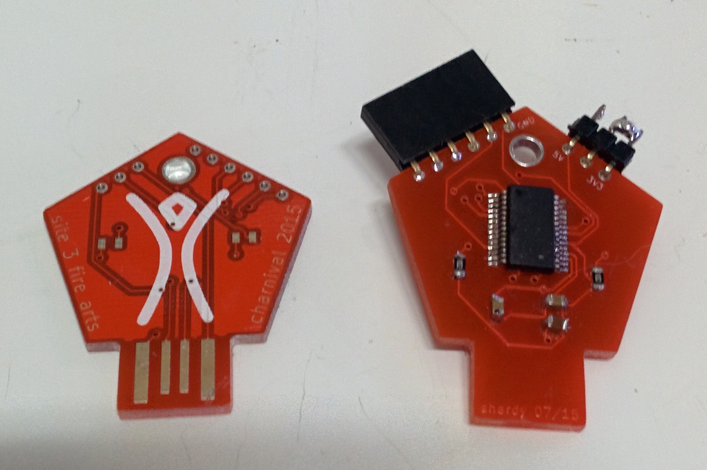

ftdigift
--------

This is a clone of the SparkFun FTDI Basic board, but in a wearable necklace form. Because people keep losing my FTDI cables at Burning Man.

### Feature Summary

* Works just like a FTDI Basic board
* Built in USB connector
* 5V or 3V3 selectable
* Technically doesn't violate Burning Man intellectual property rules regarding the man logo
* Doesn't fit that great in USB ports but does totally work
* Awkwardly small so you have to hold your Arduino or whatever at a weird angle
* Pretty red color
* You can wear it as a necklace

